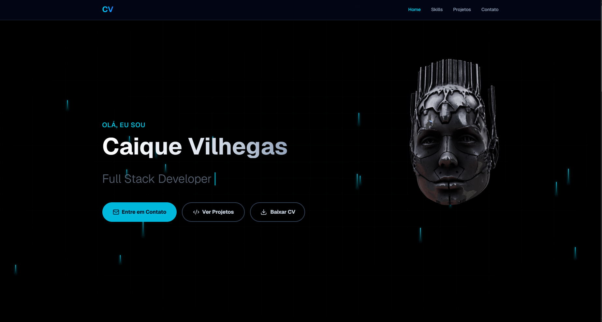
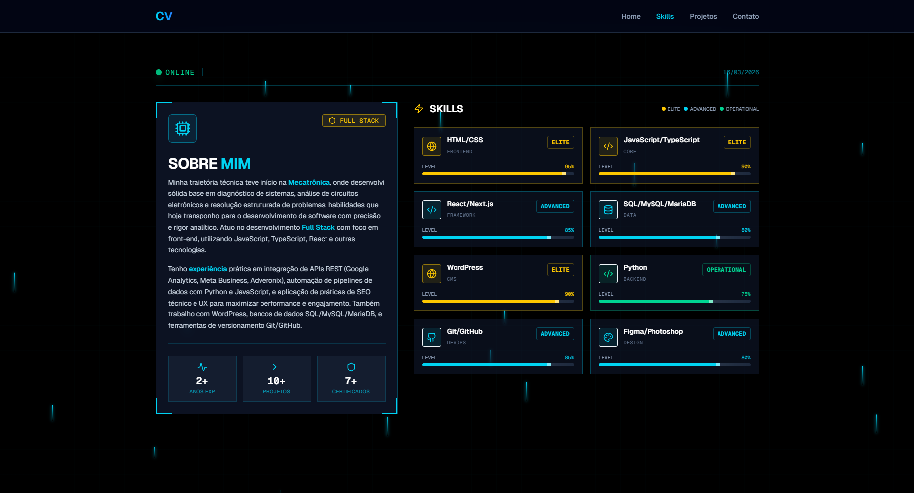
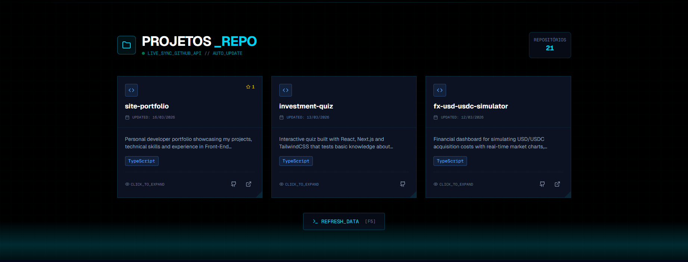
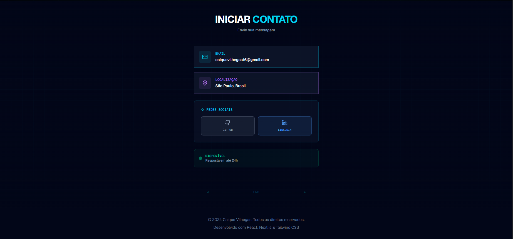

<!-- BANNER SUPERIOR -->
<div align="center">

# 🚀 Portfolio Website

**Personal portfolio developed to showcase my projects, technical skills, and experience as a Front-End Developer.**

[](https://site-portfolio-sage.vercel.app/)

</div>

---

## 📋 About the Project

This project is a personal portfolio website built to present my journey as a developer. The application features a modern and responsive interface, allowing visitors to explore my projects, technical skills, and professional profile in a clear and engaging way.

---

## 🛠️ Technologies Used

<div align="center">


</div>

---

## ✨ Features

- Project showcase section
- Technical skills section
- Responsive design for all devices
- Modern and intuitive interface

---
## 📷 Preview

<div align="center">







</div>

## 🚀 Installation and Usage

### Prerequisites

- Node.js installed

### Step by step

```bash
# Clone the repository
git clone https://github.com/vilhegas/site-portfolio.git

# Enter the project folder
cd site-portfolio

# Install dependencies
npm install

# Run the project
npm run dev
